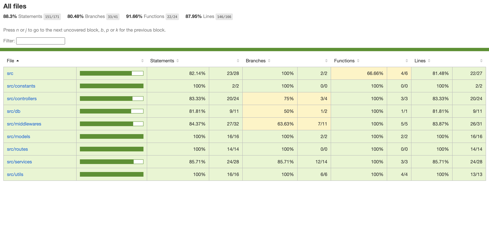

# Sukasa Air

## Running the code

- Create `.env` file at root, add below variables

```
MONGODB_URI=mongodb://localhost:27017/sukasa-air
JWT_SECRET=secret
```

- to run
  - `npm install`
  - `npm run dev`

## Code Structure

```
sukasa-air/
├── src/
│ ├── controllers/
│ │ ├── authController.ts
│ │ ├── reservationController.ts
│ ├── controllers/
│ │ ├── connectDB.ts
│ ├── middleware/
│ │ ├── authMiddleware.ts
│ │ ├── validationMiddleware.ts
│ │ ├── errorHandler.ts
│ ├── models/
│ │ ├── reservation.ts
│ │ ├── user.ts
│ ├── routes/
│ │ ├── authRoutes.ts
│ │ ├── reservationRoutes.ts
│ ├── services/
│ │ ├── authService.ts
│ │ ├── reservationService.ts
│ ├── tests/
│ │ ├── auth.test.ts
│ │ ├── reservation.test.ts
│ │ ├── tokenParser.test.ts
│ │ ├── db.test.ts
│ ├── types/
│ ├── utils/
│ │ ├── apiHandler.ts
│ │ ├── tokenParser.ts
│ ├── index.ts
├── package.json
├── tsconfig.json
└── jest.config.js
```

## Data Model Descriptions

### Reservation

A reservation is a booking object that stores information about a passenger and their seat reservation. Here are the properties of a reservation:

- `seatNumber`: A unique number representing the seat that is reserved.
- `passengerName`: The name of the passenger who has reserved the seat.
- `passengerPhone`: The phone number of the passenger.
- `passengerAge`: The age of the passenger.
- `reservedAt`: The date and time when the reservation was made.
- `user`: The user who made the reservation. This is a reference to a User document.
- `status`: The status of the reservation.[`AVAILABLE`, `RESERVED`, `PROCESSING`].

### User

Contains information regarding user, email only for current requirement

- `email`: user email

## API Documentation

[API Documentation](APIs.md)

## Tests

- run `npm run test` to run tests
- run `npm run test:coverage` to get coverage report
- Test Coverage [Report](coverage/lcov-report/index.html)

## Test Coverage Report


